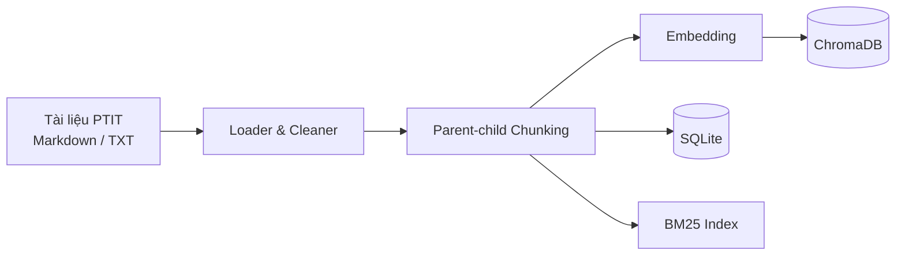
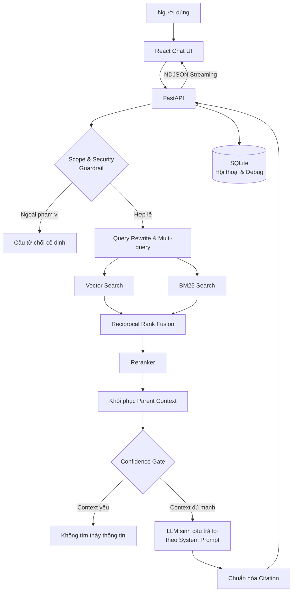

# PTIT RAG Chatbot

PTIT RAG Chatbot là hệ thống hỏi đáp tiếng Việt dành cho sinh viên Học viện Công nghệ Bưu chính Viễn thông (PTIT). Hệ thống sử dụng kiến trúc Retrieval-Augmented Generation (RAG) để tìm kiếm thông tin trong tài liệu nội bộ, chọn các đoạn bằng chứng phù hợp và tạo câu trả lời có trích dẫn nguồn.

Thay vì để mô hình trả lời hoàn toàn từ kiến thức có sẵn, chatbot chỉ sinh câu trả lời dựa trên context được truy xuất từ kho tài liệu. Cách tiếp cận này giúp giảm hallucination, tăng khả năng kiểm chứng và phù hợp với các câu hỏi về quy chế, học phí, học phần, thi cử, thủ tục sinh viên và tốt nghiệp.

## Tính năng chính

- Hỏi đáp tiếng Việt trong phạm vi tài liệu PTIT.
- Nạp tài liệu Markdown và TXT, chia nhỏ theo cấu trúc tiêu đề.
- Parent-child chunking để vừa tìm kiếm chính xác vừa giữ đủ ngữ cảnh.
- Hybrid retrieval kết hợp vector search và BM25.
- Multi-query, Reciprocal Rank Fusion và reranking kết quả.
- Guardrail chặn câu hỏi ngoài phạm vi và prompt injection.
- Confidence gate từ chối trả lời khi không tìm thấy bằng chứng đủ mạnh.
- Câu trả lời có citation tới tài liệu, mục, Điều, Khoản hoặc Điểm.
- Streaming câu trả lời trên giao diện web.
- Lưu lịch sử hội thoại và thông tin debug retrieval.
- Đánh giá chất lượng bằng Ragas.

## Tech stack

| Thành phần | Công nghệ |
|---|---|
| Frontend | React 18, Vite 5, Lucide React |
| Backend API | Python 3.10+, FastAPI, Uvicorn, Pydantic |
| LLM | OpenAI API, mặc định `gpt-4.1-mini` |
| Embedding | OpenAI `text-embedding-3-small`; hỗ trợ Sentence Transformers hoặc hash embedding |
| Vector database | ChromaDB |
| Keyword retrieval | BM25 với `rank-bm25` |
| Data storage | SQLite, SQLAlchemy |
| Reranking | Heuristic reranker hoặc CrossEncoder |
| Evaluation | Ragas, pytest |
| Deployment | Docker, Docker Compose, Nginx |

## Kiến trúc hệ thống

### Luồng nạp dữ liệu



- Tài liệu trong thư mục `data/` được đọc và làm sạch.
- Nội dung được chia thành parent chunk và child chunk, giữ metadata về tiêu đề và vị trí.
- Child chunk được embedding và lưu trong ChromaDB.
- Nội dung cùng metadata được lưu trong SQLite để hỗ trợ BM25, citation và debug.

### Luồng xử lý câu hỏi



Quy trình chính:

1. Guardrail kiểm tra phạm vi PTIT và dấu hiệu prompt injection.
2. Câu hỏi hợp lệ được chuẩn hóa và tạo nhiều truy vấn tìm kiếm.
3. Vector search và BM25 chạy song song trên kho tài liệu.
4. Kết quả được hợp nhất bằng RRF và sắp xếp lại bằng reranker.
5. Confidence gate kiểm tra độ mạnh của context.
6. LLM chỉ sử dụng context được cung cấp để trả lời.
7. Citation được kiểm tra, chuẩn hóa và trả về giao diện theo dạng streaming.

## Cấu trúc dự án

```text
PTIT Chatbot/
├── backend/
│   ├── app/
│   │   ├── api/          # API routes và request/response schema
│   │   ├── core/         # Cấu hình hệ thống
│   │   ├── db/           # SQLite, SQLAlchemy models và repositories
│   │   ├── embeddings/   # Các embedding provider
│   │   ├── generation/   # RAG chain, prompt, LLM và citation
│   │   ├── guardrails/   # Scope filter và prompt-injection protection
│   │   ├── ingestion/    # Đọc, làm sạch và chia tài liệu
│   │   ├── retrieval/    # BM25, hybrid retrieval, RRF và reranker
│   │   └── vectordb/     # ChromaDB adapter
│   ├── scripts/          # Ingest và evaluation
│   └── tests/            # Unit test và evaluation dataset
├── data/                 # Tài liệu PTIT
├── frontend/             # React/Vite web application
├── docker-compose.yml
├── .env.example
└── README.md
```

## Cách chạy dự án

### Yêu cầu

- Python 3.10 trở lên.
- Node.js 18 trở lên.
- npm.
- OpenAI API key nếu sử dụng OpenAI cho embedding, sinh câu trả lời hoặc đánh giá Ragas.
- Docker Desktop nếu chạy bằng Docker Compose.

### 1. Cấu hình môi trường

Tại thư mục gốc:

```powershell
Copy-Item .env.example .env
```

Cập nhật API key trong `.env`:

```env
OPENAI_API_KEY=your-openai-api-key
OPENAI_MODEL=gpt-4.1-mini
EMBEDDING_PROVIDER=openai
EMBEDDING_MODEL=text-embedding-3-small
```

Các cấu hình RAG mặc định đã được khai báo trong `.env.example`.

### 2. Chạy backend

```powershell
cd backend
python -m venv .venv
.venv\Scripts\Activate.ps1
python -m pip install --upgrade pip
pip install -e ".[dev]"
python -m scripts.ingest
uvicorn app.main:app --reload --port 8000
```

Backend:

- API: `http://localhost:8000`
- Swagger UI: `http://localhost:8000/docs`
- Health check: `http://localhost:8000/api/health`

Mỗi khi tài liệu trong `data/` thay đổi, chạy lại:

```powershell
cd backend
python -m scripts.ingest
```

### 3. Chạy frontend

Mở terminal mới:

```powershell
cd frontend
npm install
npm run dev
```

Giao diện chạy tại `http://localhost:5173`.

Nếu backend không chạy tại địa chỉ mặc định, tạo `frontend/.env.local`:

```env
VITE_API_BASE_URL=http://localhost:8000/api
```

### Chạy bằng Docker

```powershell
Copy-Item .env.example .env
docker compose up --build
```

Sau khi khởi động:

- Frontend: `http://localhost:5173`
- Backend: `http://localhost:8000`
- Swagger UI: `http://localhost:8000/docs`

Backend tự ingest dữ liệu trong lần chạy đầu nếu storage chưa có dữ liệu.

Nạp lại tài liệu:

```powershell
docker compose exec backend python -m scripts.ingest
```

Dừng hệ thống:

```powershell
docker compose down
```

Xóa cả dữ liệu ChromaDB và SQLite:

```powershell
docker compose down -v
```

## Kiểm thử

Chạy toàn bộ unit test:

```powershell
cd backend
pytest
```

Chạy riêng các test liên quan đến guardrail và generation:

```powershell
pytest tests/test_guardrails.py tests/test_rag_chain.py tests/test_prompts.py
```

## Đánh giá bằng Ragas

Cài dependency đánh giá:

```powershell
cd backend
pip install -e ".[eval]"
```

Chạy evaluation:

```powershell
python scripts/evaluate_ragas.py
```

Mặc định:

- Dataset: `backend/tests/fixtures/data.json`
- Số context lấy về: `top_k=4`
- Judge model: giá trị `RAGAS_JUDGE_MODEL` trong `.env`
- Embedding model: giá trị `RAGAS_EMBEDDING_MODEL` trong `.env`
- Báo cáo chi tiết: `backend/report.json`

Đánh giá trên dataset khác:

```powershell
python scripts/evaluate_ragas.py `
  --dataset tests/fixtures/ptit_ragas_100.json `
  --top-k 4 `
  --output report-100.json
```

## Kết quả metrics

Kết quả Ragas mới nhất được đo trên 50 câu hỏi, sử dụng `top_k=4`:

| Metric | Điểm | Ý nghĩa |
|---|---:|---|
| Context Precision | **0.90** | Mức độ liên quan và thứ hạng của context được truy xuất |
| Context Recall | **0.95** | Khả năng truy xuất đủ thông tin cần thiết từ tài liệu |
| Faithfulness | **0.93** | Mức độ các nhận định trong câu trả lời được context hỗ trợ |
| Answer Relevancy | **0.85** | Mức độ câu trả lời tập trung vào đúng câu hỏi |

Evaluation hoàn thành với `0` lỗi.

```text
context_precision    0.90
context_recall       0.95
faithfulness         0.93
answer_relevancy     0.85
```
